# Praktikum Git & GitHub - PPW

Repositori ini dibuat untuk memenuhi tugas praktikum mata kuliah Pengembangan Aplikasi Web. Project ini fokus pada implementasi kontrol versi menggunakan Git dan manajemen repositori di GitHub.

## Deskripsi Project
Tugas PPW pertemuan ke 10 mengenai git dan github 

## Langkah Langkah 1
1. Buat sebuah repository pada github beri nama praktikum-git-NIU

2. melakukan clone dengan url yang muncul pada repository dan menyalinnya ke terminal dengan git clone sehingga dan klik enter
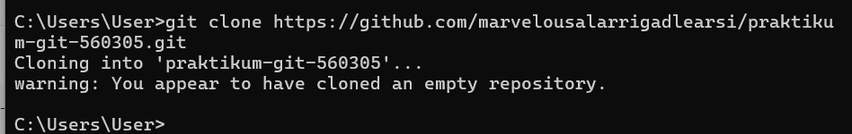

3. menambahkan file baru yang namanya .gitignore lalu didalamnya adalah .DS_Store
*.log
node_modules/ lalu melakukan commit dengan perintah git commit-m "chore: add .gitignore" yang artinya kita menambahkan commit dengan komen chore: add .gitignore (seperti yang saya tampilkan di baris pertama log commit yang saya panggil dengan git log --oneline)
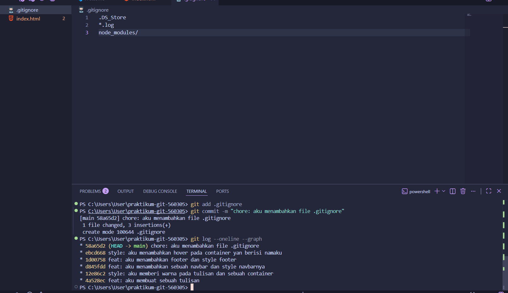

4. Hasil git log:
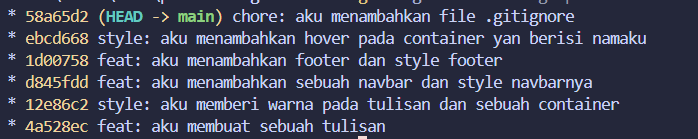

## Langkah langkah 2
1. membuat 3 buah branch yaitu feature/navbar, feature/footer, dan hotfix/typo dengan perintah git branch feature/footer untuk membuatnya atau langsung git checkout feature/footer untuk langsung ke branchnya 
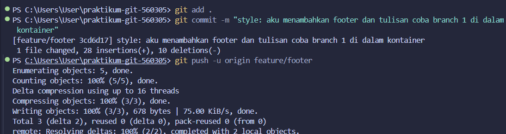
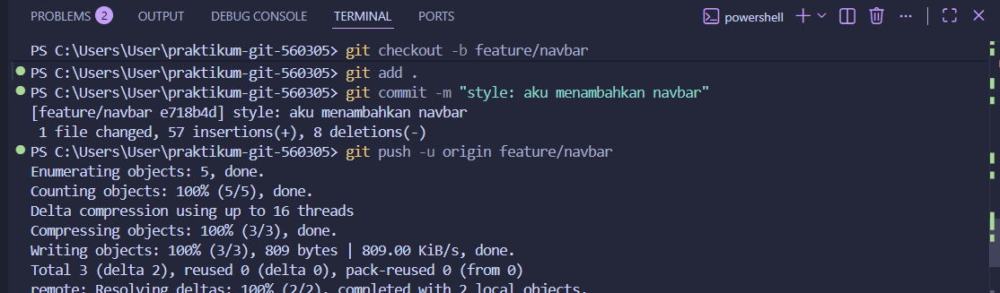
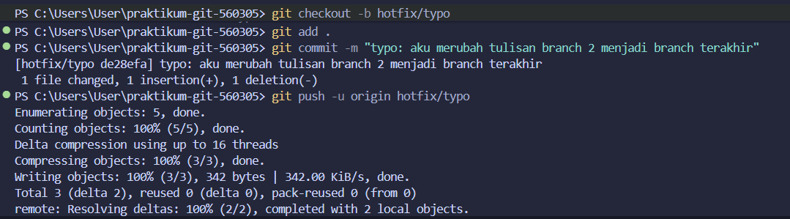

2. pada gambar diatas setiap branch sudah di push, menuju ke tab github dan PR setiap branch dan beri judul yang jelas sampai menjadi seperti pada gambar
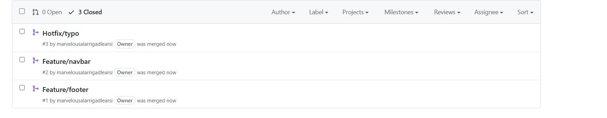

3. jadi satu dengan nomor 2

4. Pasang branch protection commit rule di github
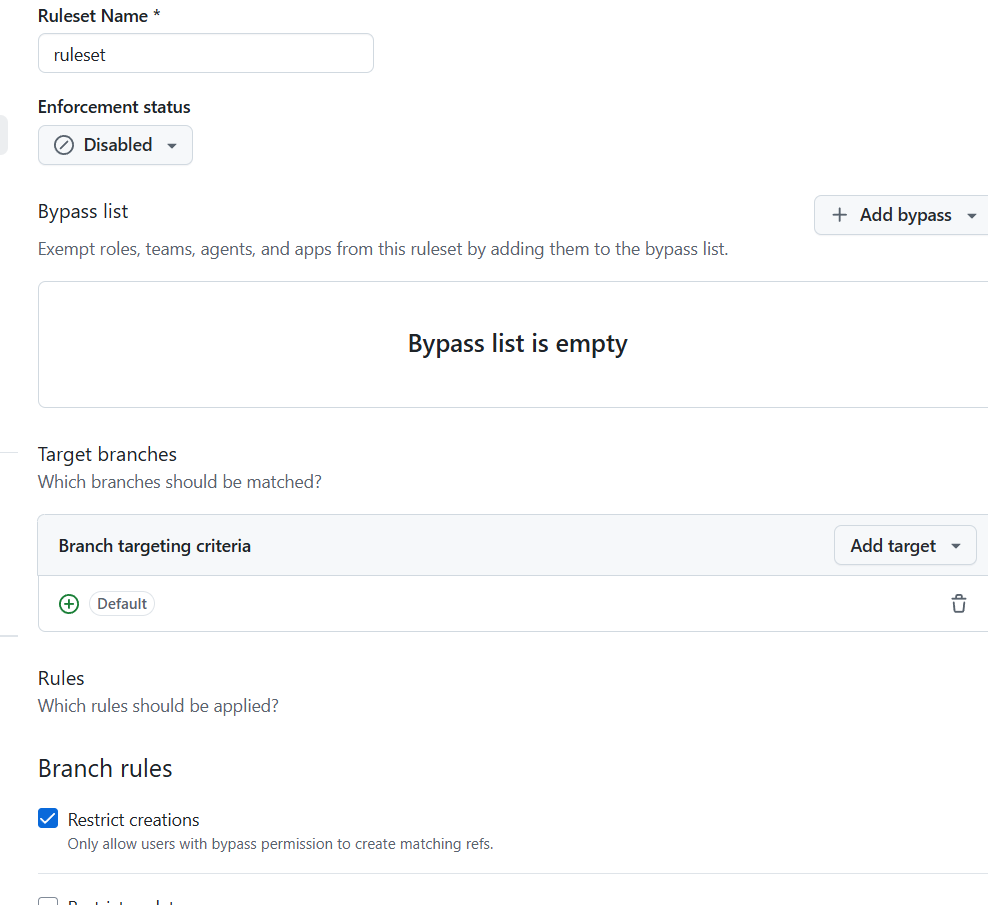

## Langkah langkah 3
1. membuat 2 branch, yaitu experiment/color-A dan experiment/color-B. Dimana kedua branch, ubah baris CSS yang sama yaitu warna background yaitu pink dan soft blue
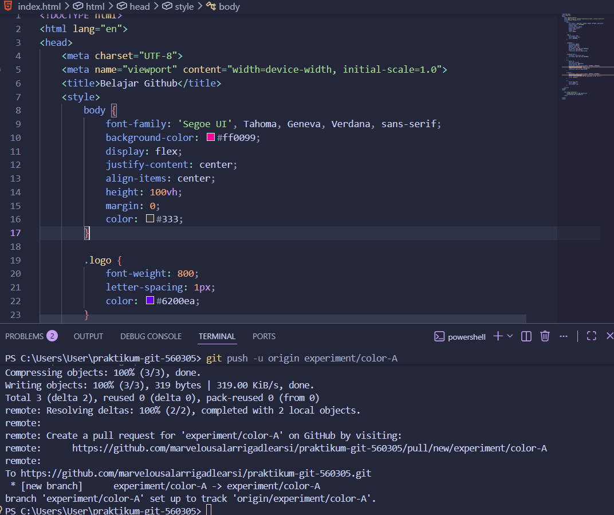
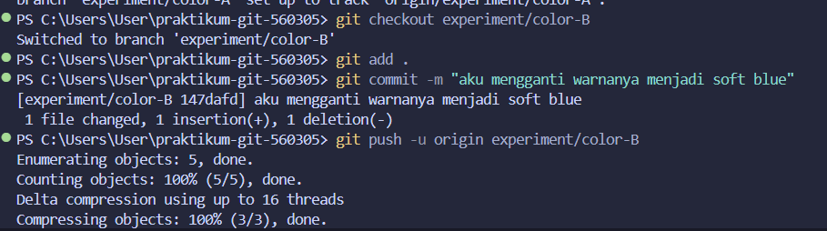
 maka akan menimbulkan konflik karena yang dirubah kedua branch adalah 1 baris yang sama dan perubahan beda maka merge kedua nya dengan perintah git push -u origin sehingga muncul tampilan seperti berikut
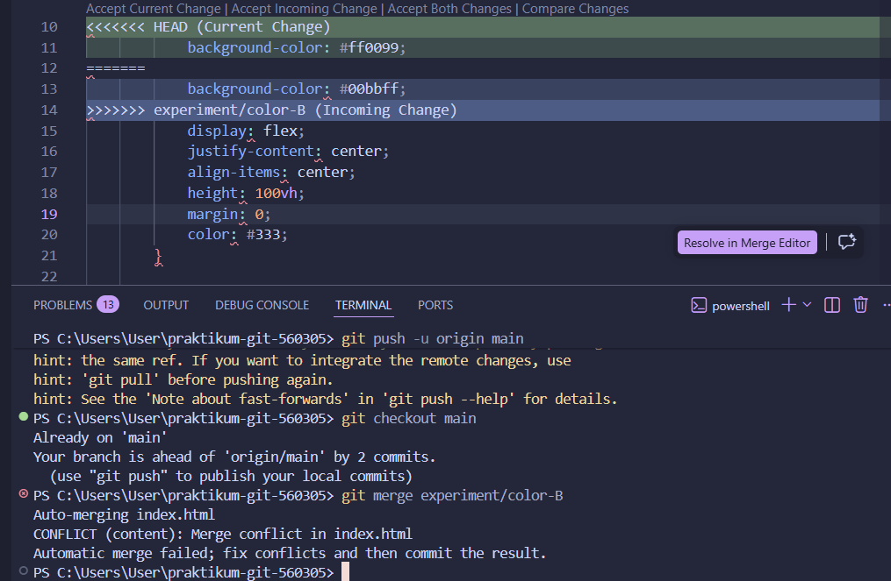

2. lakukan merge dengan perintah git merge serta fix conflictnya secara manual di vscode
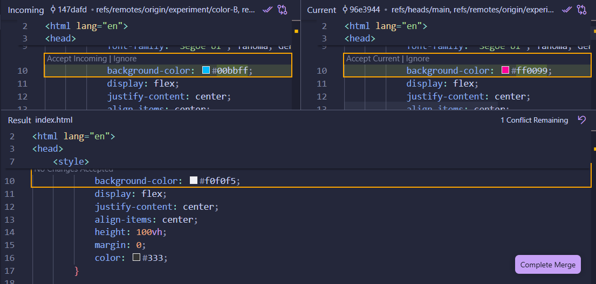

3. membuat branch baru bernama feature/dark-mode yang berisi 3 commit di sana. Kemudian masuk ke interactive rebase untuk menggabungkan (squash) 3 commit menjadi 1 commit dengan pesan yang baik.
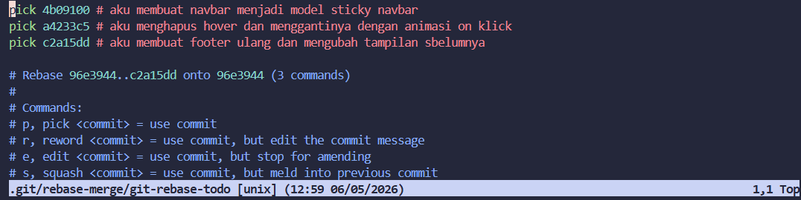
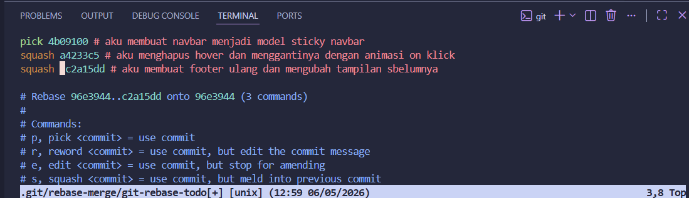
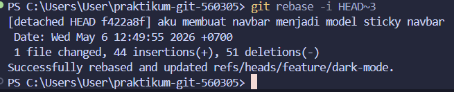

## Langkah langkah 4
1. dimulai dengan mengatur Issues di GitHub, dengan membuat Issues . Setiap issue diberikan judul yang spesifik, seperti rencana implementasi fitur atau laporan bug, serta deskripsi singkat mengenai tugas yang akan diselesaikan agar terdokumentasi dengan jelas sebagai nomor #1, #2, dan #3. Setelah perencanaan selesai, tahap kedua adalah pengerjaan teknis melalui Branching, di mana dilakukan dengan berpindah dari branch utama ke cabang baru menggunakan perintah git checkout -b [nama-branch] untuk mulai memodifikasi kode. Proses ini mencakup penambahan elemen desain seperti Sticky Navbar atau Footer yang kemudian disimpan dan diunggah ke GitHub menggunakan rangkaian perintah git add, git commit, dan git push.

Tahap ketiga merupakan inti dari integrasi, yaitu penutupan issue secara otomatis melalui Pull Request (PR). Saat membuat PR di halaman GitHub, cantumkan kata kunci Closes # diikuti dengan nomor issue terkait (misalnya Closes #1) di dalam kolom deskripsi. Penggunaan kata kunci ini sangat krusial karena berfungsi sebagai pemicu otomatisasi yang akan mengubah status issue tersebut dari Open menjadi Closed tepat setelah proses penggabungan kode atau merge disetujui. 
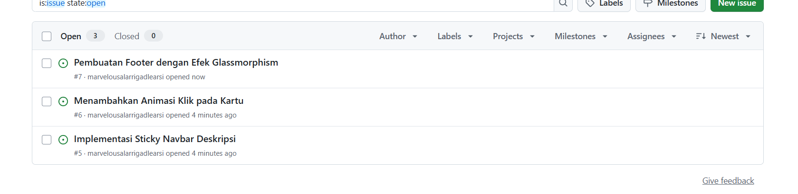
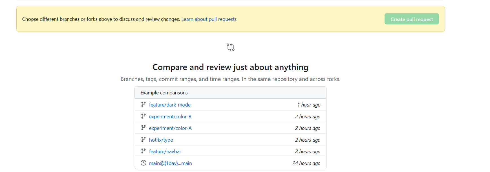
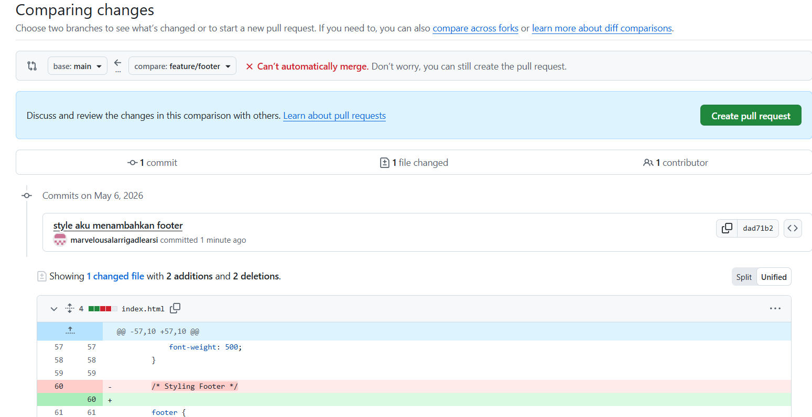
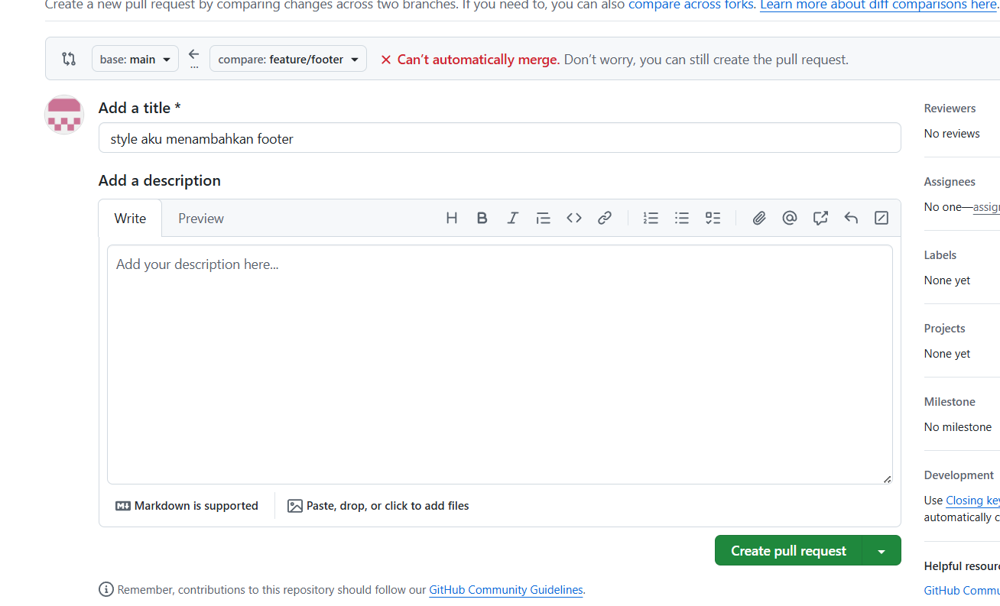
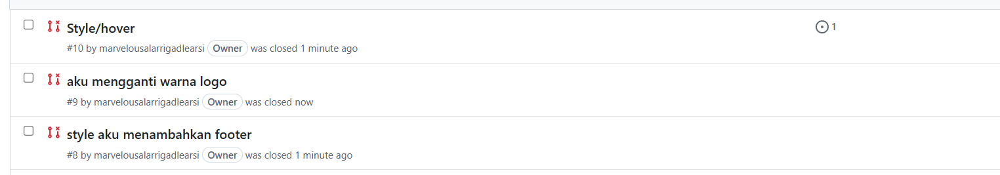

2. Menuju ke repository pada menu settings lalu add colaborator tambahkan colaborator dosen dan juga asisten dosen.
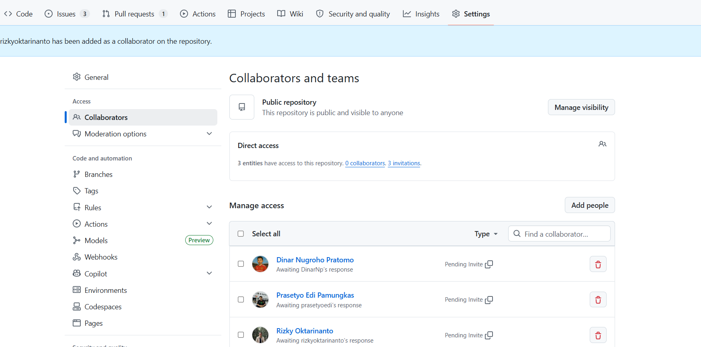
3. relese dengan klick menu release, draft a new release dan ketik v1.0.0 lalu klick Create new tag. Kemudian isi judul dan deskribsi dan klick public realese

